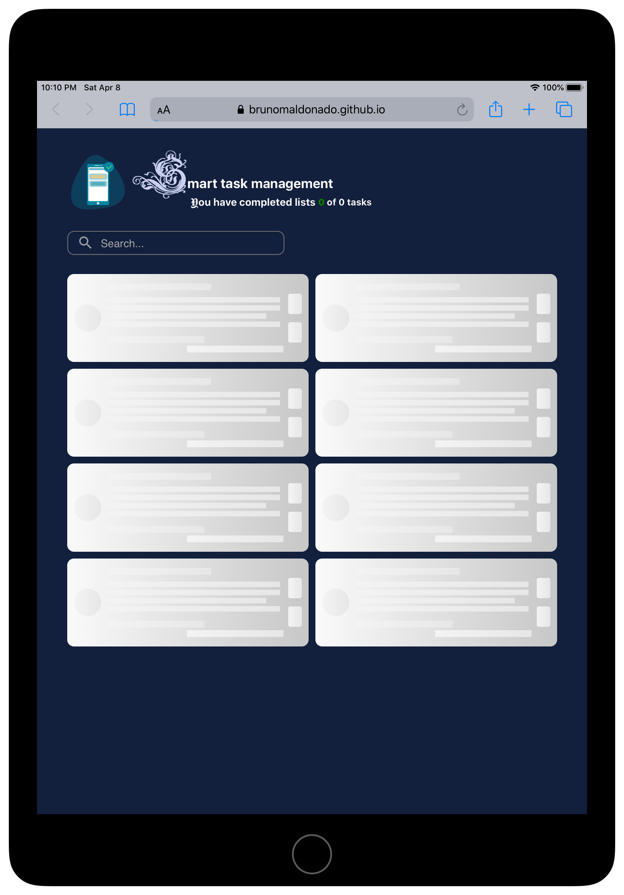

## Introduction to React Course.

------------
### tablet

<!-- 

  

 -->
<table>
  <tr>
    <td valign="top"></td>
    <td valign="top"></td>
  </tr>
</table>
<!-- 

  

  
  
  

 -->

------------
### & mobile

<table>
  <tr>
    <td valign="top"></td>
    <td valign="top"></td>
  </tr>
</table>

------------
